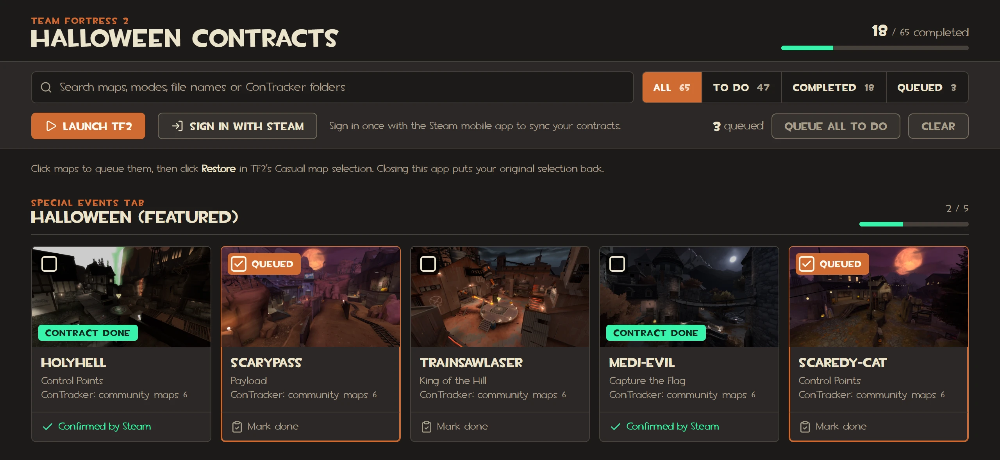

# TF2 Halloween Contracts

A checklist for Team Fortress 2's Halloween map contracts. It shows every Halloween map from the casual menu, pulls which contracts you have already completed from your Steam account, follows the match you are in, and writes the maps you still need straight into TF2's casual queue.



## What it does

- Lists all 65 Halloween maps grouped the way the casual menu groups them, with the ConTracker folder each contract sits in.
- Signs in to Steam once with a QR code from the Steam mobile app and syncs your completed contracts from the TF2 Game Coordinator. No password is typed anywhere.
- Shows the map you are playing right now, with its ConTracker folder, so you can find the contract in game. Asks whether you finished the contract when the match ends.
- Queues maps for you: click a tile here, click **Restore** in TF2's casual map selection, and TF2 loads that queue. Your original selection is put back when you close the app.
- Syncs again by itself when TF2 closes, and lets you mark a contract done by hand in the meantime.

## Requirements

- Windows, with Team Fortress 2 installed through Steam. The app finds TF2 through Steam's library list.
- The Steam mobile app, for the one-time sign-in.

## Quick start

Download `tf2-halloween-contracts.exe` from the [latest release](https://github.com/Rhgx/tf2-halloween-contracts/releases/latest) and run it. A console window opens with the log, and the app opens in your browser at `http://127.0.0.1:2715`. Keep the console window open while you use the app. Closing it restores your original casual map selection.

The exe is not code-signed, so the first run shows a SmartScreen warning. Click **More info**, then **Run anyway**. Your settings and Steam token are kept in `%APPDATA%\tf2-halloween-contracts`.

To let the app follow your matches, add `-condebug` to TF2's launch options in Steam (right-click the game, Properties, Launch Options). Without it, everything else still works.

### From source

With Node.js 26 or newer:

```
git clone https://github.com/Rhgx/tf2-halloween-contracts.git
cd tf2-halloween-contracts
npm install
npm start
```

This builds the app and starts the same server; data then lives in the repo's `data` folder.

## Using it

1. Click **Sign in with Steam** and scan the QR code in the Steam mobile app. The app syncs your completed contracts right away.
2. Click the maps you still want to play, or **Queue all to do**. Then open the casual map selection in TF2 and click **Restore**.
3. Play. The current map and its ConTracker folder show at the top of the page. When TF2 closes, the app syncs again so the checklist stays current.

Syncing is blocked while TF2 is running, because Steam only allows one game session per account. The app never takes that session over.

## More

- [How the Steam sign-in and sync work, and what is stored](.docs/steam-sync.md)
- [How the app follows TF2 and writes the casual queue](.docs/tf2-integration.md)
- [Development: scripts, layout, and updating the map list](.docs/development.md)
- [Credits for the fonts and screenshots](.docs/credits.md)

## License

The code is under the [MIT License](LICENSE). Map screenshots and fonts are Valve's; see [credits](.docs/credits.md).
